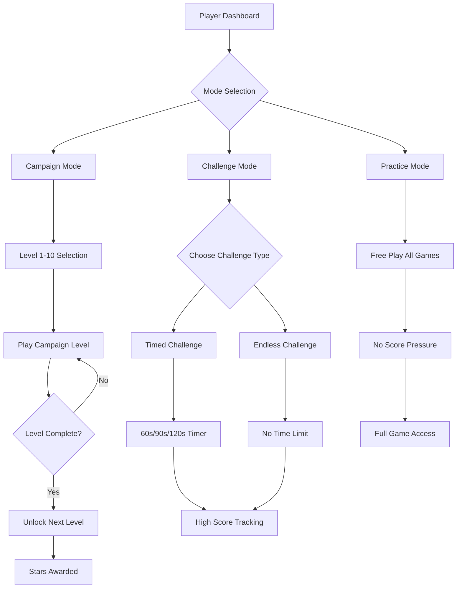

# MathQuest Game Mode System Architecture

## Executive Summary

This document outlines the architecture for implementing a new game mode system for MathQuest arcade. The system introduces three distinct play modes (Campaign, Challenge, Practice) with a Kenyan transport theme (bajajis, bodabodas, daladalas) integrated into game visuals and characters.

---

## 1. Current State Analysis

### 1.1 Existing Architecture

```
┌─────────────────────────────────────────────────────────────────┐
│                        App.tsx                                  │
│  ┌──────────────┐  ┌──────────────┐  ┌───────────────────────┐ │
│  │ Game Cards   │  │ Game Mode    │  │ Level Progress       │ │
│  │ Selection    │──│ Selector     │──│ (currently 1-5)      │ │
│  └──────────────┘  └──────────────┘  └───────────────────────┘ │
│         │                 │                     │               │
│         ▼                 ▼                     ▼               │
│  ┌──────────────────────────────────────────────────────────┐  │
│  │              Individual Game Components                  │  │
│  │  Driving | TugOfWar | Racing | Bridge | Space | Battle   │  │
│  └──────────────────────────────────────────────────────────┘  │
│                              │                                  │
│                              ▼                                  │
│  ┌──────────────────────────────────────────────────────────┐  │
│  │              onComplete() → Level Up Logic               │  │
│  └──────────────────────────────────────────────────────────┘  │
└─────────────────────────────────────────────────────────────────┘
```

### 1.2 Current Types (src/types.ts)

```typescript
// Current GameMode type
export type GameMode = 'normal' | 'timed' | 'endless' | 'battle';

// Current level_progress
export interface Player {
  level_progress: Record<GameType, number>;  // Currently capped at 5
}
```

---

## 2. Proposed Architecture

### 2.1 New GameMode Types

```typescript
// New GameMode type
export type GameMode = 'campaign' | 'challenge' | 'practice';

// Campaign sub-states
type CampaignProgress = {
  currentLevel: number;      // 1-10
  starsEarned: number;       // Per level stars
  isUnlocked: boolean;
  bestScore: number;
};

// Challenge sub-states  
type ChallengeConfig = {
  type: 'timed' | 'endless';
  timeLimit?: number;        // For timed mode (seconds)
  targetScore?: number;      // Optional target for timed
};
```

### 2.2 New Architecture Flow



### 2.3 Component Structure

```
src/
├── components/
│   ├── ModeSelector.tsx          # NEW: Mode selection screen
│   ├── CampaignMap.tsx          # NEW: 10-level campaign map
│   ├── ChallengeLobby.tsx       # NEW: Challenge mode setup
│   ├── LevelCard.tsx            # NEW: Individual level display
│   ├── games/
│   │   ├── DrivingGame.tsx      # Modify: Add 10-level support
│   │   ├── TugOfWarGame.tsx     # Modify: Add 10-level support
│   │   ├── RacingGame.tsx       # Modify: Add 10-level support
│   │   ├── BridgeGame.tsx       # Modify: Add 10-level support
│   │   ├── SpaceGame.tsx        # Modify: Add 10-level support
│   │   └── BattleGame.tsx       # Modify: Add 10-level support
│   └── themes/
│       └── KenyanTransport.tsx  # NEW: Transport theme assets
├── config/
│   ├── campaign.ts               # NEW: Campaign level configs
│   └── challenges.ts            # NEW: Challenge configurations
└── types.ts                      # Modify: Extend GameMode type
```

---

## 3. Mode Specifications

### 3.1 Campaign Mode

**Description**: Progressive 10-level campaign for each game with unlocking system.

**Level Progression:**
| Level | Operations | Difficulty | Stars Required | Theme Element |
|-------|------------|------------|----------------|---------------|
| 1 | Addition | Easy | - | Bajaji Tutorial |
| 2 | Subtraction | Easy | 1⭐ | Bodaboda Basic |
| 3 | Add/Subtract | Medium | 2⭐ | Daladala Routes |
| 4 | Multiplication | Medium | 3⭐ | Bajaji Speed |
| 5 | Division | Hard | 4⭐ | Bodaboda Master |
| 6 | Mixed Ops | Medium | 5⭐ | City Traffic |
| 7 | Mixed Ops | Hard | 6⭐ | Safari Adventure |
| 8 | Complex | Hard | 7⭐ | Nairobi Rush |
| 9 | Expert | Hard | 8⭐ | Mombasa Ports |
| 10 | Master | Expert | 9⭐ | Champion Cup |

**Features:**
- Level unlock progression (complete L1 → unlock L2)
- Star-based bonus rewards
- Boss levels at 5 and 10
- Story/narrative between levels

### 3.2 Challenge Mode

**Description**: Timed and endless high-score competitive play.

**Timed Challenge:**
- Duration options: 60s, 90s, 120s
- Target scores to achieve
- Leaderboard rankings
- Bonus multipliers for early completion

**Endless Challenge:**
- No time limit
- Progressive difficulty increase
- Survival mechanics
- High score tracking

### 3.3 Practice Mode

**Description**: Pressure-free practice with full game access.

**Features:**
- All games accessible
- No level restrictions
- Adjustable difficulty
- No star/score penalties
- Learning hints enabled

---

## 4. Kenyan Transport Theme

### 4.1 Theme Elements

**Vehicle Replacements:**
| Original | Kenyan Transport | Description |
|----------|------------------|--------------|
| Car | Bajaji (Auto-rickshaw) | Yellow/black Nairobi style |
| Motorcycle | Bodaboda | Red/orange racing style |
| Bus | Daladala | Colorful minibus |
| Truck | Matatu | Modified pickup |

**Visual Elements:**
- Nairobi skyline backgrounds
- Kenyan road signs
- Maasai Mara safari elements
- Coastal Mombasa themes for higher levels

**Character Themes:**
- Level 1-3: Bajaji driver guide
- Level 4-6: Bodaboda racer
- Level 7-10: Daladala conductor

### 4.2 Theme Integration Points

```typescript
// Theme configuration
interface KenyanTransportTheme {
  vehicles: {
    primary: 'bajaji' | 'bodaboda' | 'daladala' | 'matatu';
    colors: {
      primary: string;
      accent: string;
    };
  };
  background: 'nairobi' | 'coast' | 'safari' | 'highland';
  music: 'bongo' | 'safari' | 'traditional';
}
```

---

## 5. Implementation Plan

### Phase 1: Core Infrastructure

1. **Update Types** (`src/types.ts`)
   - Extend GameMode type
   - Add CampaignLevel and ChallengeConfig interfaces
   - Update Player type with new progress tracking

2. **Create Mode Selector** (`src/components/ModeSelector.tsx`)
   - Three mode cards with descriptions
   - Animated transitions
   - Player stats preview

### Phase 2: Campaign Mode

3. **Create Campaign Config** (`src/config/campaign.ts`)
   - 10 level definitions per game
   - Star requirements
   - Operation mapping

4. **Create Campaign Map** (`src/components/CampaignMap.tsx`)
   - Visual level progression
   - Lock/unlock states
   - Star display

5. **Update Level Logic** (all game components)
   - Expand from 5 to 10 levels
   - Update difficulty scaling
   - Add boss level mechanics

### Phase 3: Challenge & Practice

6. **Create Challenge Lobby** (`src/components/ChallengeLobby.tsx`)
   - Timed/Endless selection
   - Time limit options
   - Leaderboard preview

7. **Update Game Logic**
   - Add Practice mode flags
   - Remove scoring for practice
   - Add learning hints

### Phase 4: Theme Integration

8. **Create Theme Assets** (`src/components/themes/KenyanTransport.tsx`)
   - Vehicle 3D models/configs
   - Background configurations
   - Sound effect mappings

9. **Update Games**
   - Replace vehicle visuals
   - Add background themes
   - Integrate sound effects

---

## 6. Data Flow

### 6.1 Campaign Progress

```typescript
// New player progress structure
interface CampaignProgress {
  [gameType: GameType]: {
    currentLevel: number;      // 1-10
    stars: number;             // Total stars earned
    bestScores: number[];      // Best score per level
    unlocked: boolean[];
    completed: boolean[];
  };
}

// Storage: localStorage
{
  math_campaign_progress: CampaignProgress
}
```

### 6.2 Challenge Records

```typescript
interface ChallengeRecord {
  gameType: GameType;
  challengeType: 'timed' | 'endless';
  score: number;
  date: string;
  duration?: number;
}
```

---

## 7. UI/UX Design

### 7.1 Mode Selection Screen

```
┌─────────────────────────────────────────────────────────────┐
│                    🚌 MATHQUEST 🚕                           │
│                                                              │
│   ┌─────────────┐  ┌─────────────┐  ┌─────────────┐        │
│   │  CAMPAIGN   │  │ CHALLENGE   │  │  PRACTICE   │        │
│   │    📈       │  │    🏆       │  │    📚       │        │
│   │             │  │             │  │             │        │
│   │ 10 Levels   │  │  High Score │  │  Free Play  │        │
│   │ Progressive │  │  Timed/     │  │  No         │        │
│   │ Unlocks     │  │  Endless    │  │  Pressure   │        │
│   └─────────────┘  └─────────────┘  └─────────────┘        │
│                                                              │
│   Your Progress: 3/60 Stars    Best: Level 4                │
└─────────────────────────────────────────────────────────────┘
```

### 7.2 Campaign Map (per game)

```
┌─────────────────────────────────────────────────────────────┐
│            🚕 DRIVING ADVENTURE - CAMPAIGN                  │
│                                                             │
│   Level 10 [🏆] ───── Level 9 [🔒] ──── Level 8 [⭐]       │
│        │                                                      │
│   Level 5 [⭐] ───── Level 4 [⭐] ──── Level 3 [⭐]         │
│        │                                                      │
│   Level 2 [⭐] ───── Level 1 [⭐]                            │
│                                                             │
│   🚌 Bajaji → Bodaboda → Daladala → Matatu → Champion────────────────────────────     │
└─────────────────────────────────┘
```

---

## 8. Key Changes Summary

| Component | Current | Proposed |
|-----------|---------|----------|
| GameMode | normal/timed/endless/battle | campaign/challenge/practice |
| Levels | 1-5 | 1-10 |
| Progress | level_progress only | campaign_progress + challenge_records |
| Theme | Default | Kenyan Transport (bajaji/bodaboda/daladala) |
| Stars | Global | Per-game, per-level |
| UI | Simple game select | Mode selector + campaign map |

---

## 9. Backward Compatibility

- Maintain existing player data
- Migrate current level_progress to new format
- Default new players to Practice mode tutorial
- Preserve existing scores and achievements
